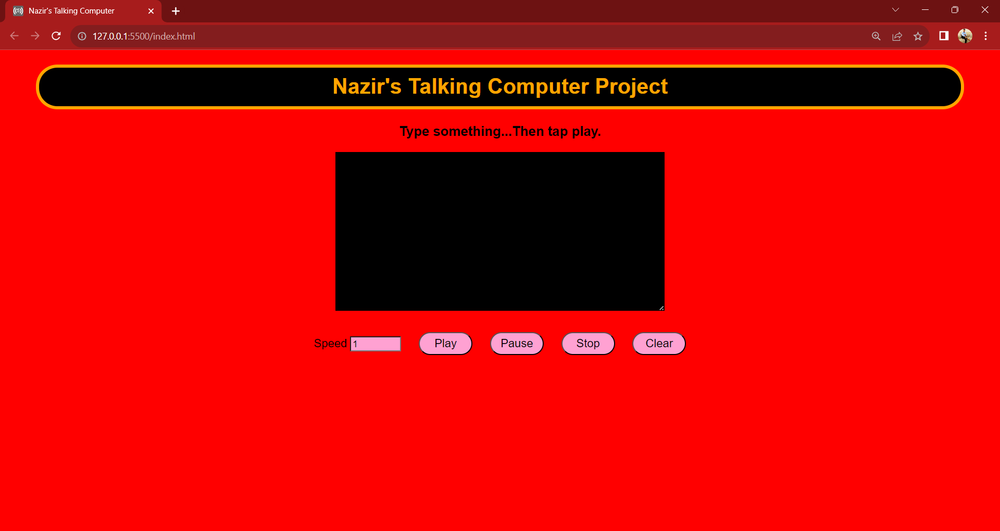

# Talking Computer Project

### Description
In the year 2021, I undertook the challenge of building this project to further refine my proficiency in HTML, CSS, and JS. This endeavor not only provided valuable practice but also became a practical solution for times when I'd rather avoid delving into lengthy paragraphs or when I simply prefer having the content read aloud. The project stands as a testament to my commitment to continuous improvement in web development, combining technical skill enhancement with the creation of a functional and user-friendly tool for personalized convenience.

## This project does the following

  - Reads whatever text you want it to read outloud
  - You can adjust the speed at which the speechsynthesis is talking
  - You can pause the speechsynthesis and stop it from reading text

### Technologies Used

  - HTML
  - CSS
  - JavaScript

Deployed Site: https://batking74.github.io/Talking_Computer_Project/

GitHub Repo: https://github.com/Batking74/Talking_Computer_Project
